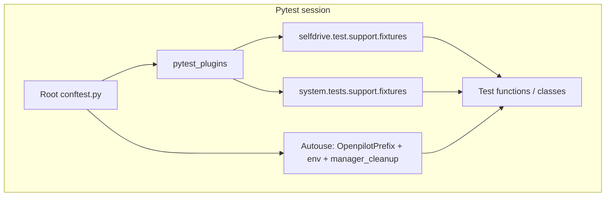
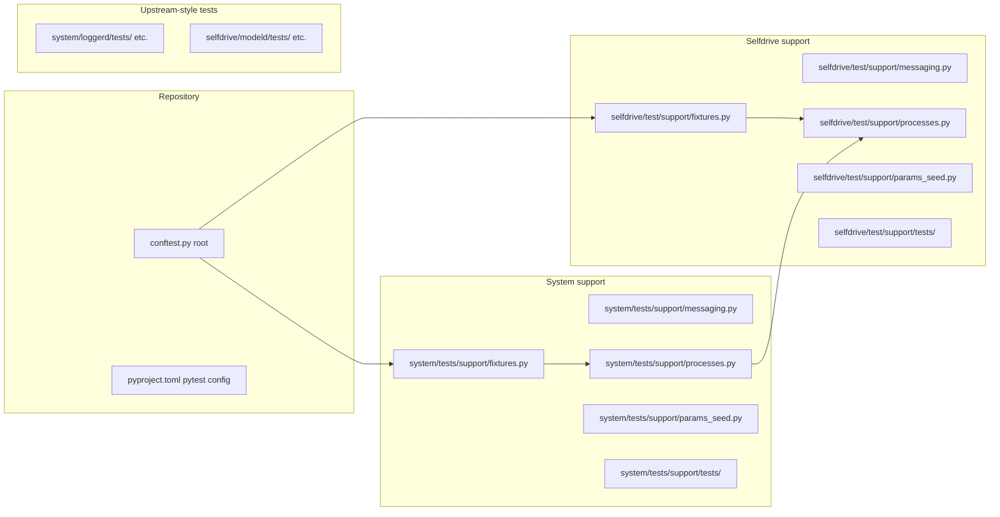
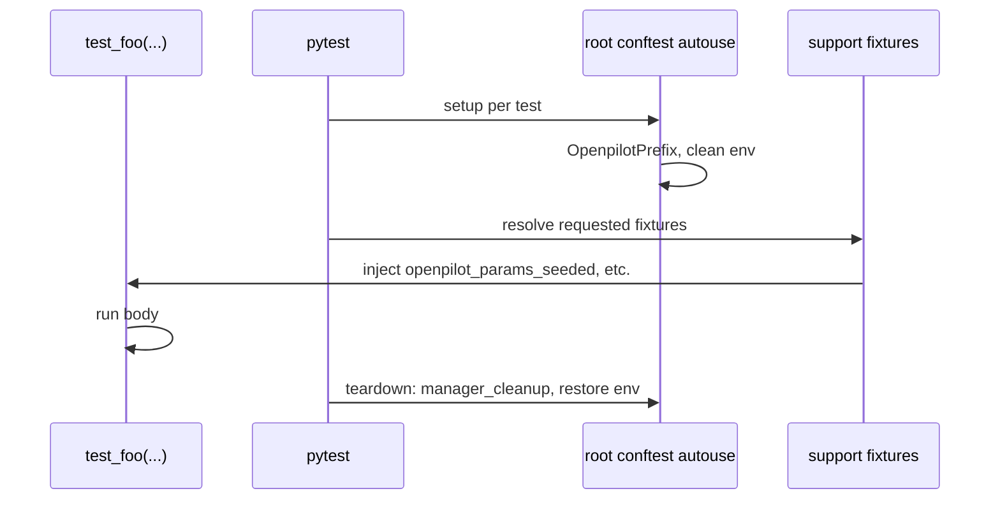
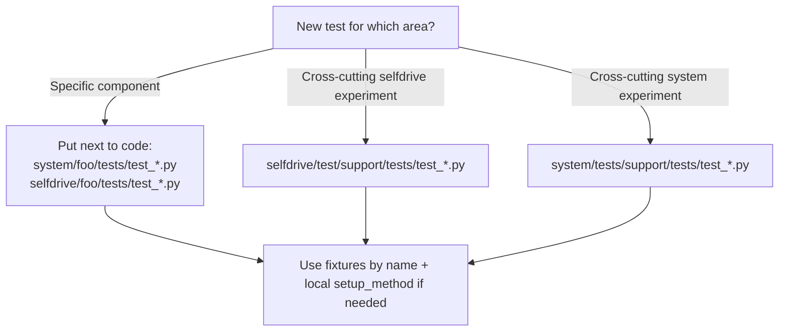

# Testing infrastructure: how it works and how to add tests

This document explains the shared test harness your group added on top of upstream openpilot’s pytest setup: what runs first, where code lives, and how to plug in new tests. It complements the [Software Test Plan](testing-plan/TESTING-PLAN.md) and the [low-level execution plan](LOW-LEVEL-TEST-PLAN.md).

---

## 1. Big picture

Pytest starts from the **repository root**. The root `conftest.py` does three important things for every Python test:

1. **Loads shared fixtures** via `pytest_plugins`, so any test file can request fixtures by name without importing them.
2. **Wraps each test** in an autouse fixture that isolates environment, sets `OPENPILOT_PREFIX`, seeds `random`, and cleans up processes after the test.
3. **Skips or sets up device tests** marked `@pytest.mark.tici` when not on TICI hardware.

Your **support packages** (`selfdrive/test/support/` and `system/tests/support/`) add reusable helpers and fixtures. They do not replace upstream patterns such as `selfdrive/test/helpers.py` or per-component `tests/` trees; they extend the same trees upstream already uses (`selfdrive/test/`, `system/tests/`).



---

## 2. `testpaths` versus root `conftest.py`

These are **different jobs** in pytest; both are normal.

| Mechanism | Role |
|-----------|------|
| **`testpaths` in `pyproject.toml`** | Tells pytest **which directories to search** for `test_*.py` (and friends). Only paths here (plus CLI paths) participate in **collection** for a default `pytest` run. |
| **`pytest_plugins` in root `conftest.py`** | **Imports fixture modules by dotted name** so their `@pytest.fixture` definitions are registered **globally**. Those modules do **not** need to appear again in `testpaths`; they are libraries, not test files. |
| **Root autouse fixtures / hooks** | Same `conftest.py`: session-wide behavior (prefix isolation, `manager_cleanup`, TICI skipping). |

So: **collection roots** are configured in `pyproject.toml`; **fixture registration** is configured next to the rest of pytest hooks in `conftest.py`. Duplicating the support package path in `testpaths` would not register fixtures—you still need `pytest_plugins` (or fixtures defined directly in `conftest.py`).

**Upstream naming:** this repo uses **`selfdrive/test/`** (singular) for shared selfdrive test utilities, and **`system/tests/`** (plural) for top-level system tests such as `test_logmessaged.py`. System support lives under **`system/tests/support/`** so it stays in the same tree instead of inventing a parallel `system/test/`.

---

## 3. Where things live



| Location | Purpose |
|----------|---------|
| Root `conftest.py` | Global lifecycle, `pytest_plugins`, TICI hooks, `collect_ignore` |
| `pyproject.toml` `[tool.pytest.ini_options]` | `testpaths`, markers (`slow`, `tici`), xdist defaults, strict markers |
| `selfdrive/test/support/` | Helpers + fixtures for **selfdrive-oriented** tests (params, processes, calibration message builder) |
| `system/tests/support/` | Helpers + fixtures for **system daemon** tests (daemon params, pub/sub factory; process scope reuses selfdrive); sits under existing `system/tests/` |
| `*/tests/conftest.py` (harness only) | In `support/tests/`, maps “no tests collected” to exit code 0 for empty harness runs |
| Component folders e.g. `system/loggerd/tests/` | **Normal** place for production tests next to the code under test |

---

## 4. How fixtures reach your test

When a test function lists a name in its parameters, pytest **injects** the matching fixture. Fixture definitions live in:

- `openpilot.selfdrive.test.support.fixtures`
- `openpilot.system.tests.support.fixtures`

Both modules are registered in root `conftest.py`:

```23:26:conftest.py
pytest_plugins = [
  "openpilot.selfdrive.test.support.fixtures",
  "openpilot.system.tests.support.fixtures",
]
```

**Naming rule:** System fixtures are prefixed with `system_` so they never collide with selfdrive fixtures (for example `pub_sub_factory` vs `system_pub_sub_factory`).



---

## 5. What each fixture / helper is for

### Selfdrive (`openpilot.selfdrive.test.support`)

| Name | Type | Use when |
|------|------|----------|
| `openpilot_params_seeded` | fixture | You need the same baseline Params as `set_params_enabled` (terms, training, calibration blob, fingerprint). |
| `managed_processes_ctx` | fixture | You get a callable that is `managed_process_scope(...)` — context manager around `processes_context` to start/stop named processes. |
| `pub_sub_factory` | fixture | You need `PubMaster` / `SubMaster` for explicit service lists (never pass an empty list to `SubMaster`). |
| `seed_minimal_openpilot_params()`, `managed_process_scope`, `new_live_calibration_message` | import from package | Same logic outside pytest or inside a helper. |

### System (`openpilot.system.tests.support`)

| Name | Type | Use when |
|------|------|----------|
| `system_daemon_params` | fixture | Typical daemon defaults: `IsOffroad`, `DongleId` (pattern from loggerd-style tests). |
| `system_full_stack_params` | fixture | Selfdrive minimal seed **plus** daemon params — cross-layer scenarios. |
| `system_managed_processes_ctx` | fixture | Same as `managed_processes_ctx` (delegates to selfdrive `managed_process_scope`). |
| `system_pub_sub_factory` | fixture | Same idea as `pub_sub_factory`, implemented via `make_pub_sub`. |
| `seed_system_daemon_params`, `seed_full_stack_params`, `make_pub_sub` | import from package | Non-fixture use. |

Process scoping ultimately calls **`selfdrive.test.helpers.processes_context`**, which is the upstream-approved pattern for `managed_processes`.

---

## 6. Where to put a new test



**Default:** add `test_*.py` under the **same tree as the feature** (for example `system/athena/tests/`). That keeps failures localized and matches upstream.

**Harness folders** (`selfdrive/test/support/tests/`, `system/tests/support/tests/`) are for experiments or shared regression tests that do not belong to a single submodule. They start empty on purpose; their `conftest.py` only normalizes exit status when nothing is collected yet.

---

## 7. How to implement a test (step by step)

1. **Pick the file location** using the decision above.
2. **Choose fixtures** by what you need:
   - Car / openpilot toggle / calibration: `openpilot_params_seeded` or `system_full_stack_params`.
   - Loggerd / uploader-style daemons: often `system_daemon_params` alone or combined with others.
   - Multiple processes: `with managed_processes_ctx()(["procA", "procB"]):` or the `system_` equivalent.
   - Messaging: `pub_sub_factory` or `system_pub_sub_factory` to build masters, then send/subscribe in the test body.
3. **Rely on root autouse** for isolation; do not assume dirty global state from other tests.
4. **Mark** `@pytest.mark.slow` or `@pytest.mark.tici` when appropriate (`pyproject.toml` registers these; unknown markers fail in strict mode).
5. **Document traceability** in a short docstring (for example `Maps: R5`) to align with the STP risk IDs.
6. **Run scoped pytest** first (single file or directory), then broader suites as needed.

### Minimal examples (patterns only)

**Function test with fixtures:**

```python
def test_example(system_daemon_params, system_pub_sub_factory):
  pm, sm = system_pub_sub_factory(["somePubTopic"], ["someSubTopic"])
  # arrange / act / assert
```

**Class test with process scope:**

```python
class TestFoo:
  def test_bar(self, managed_processes_ctx):
    with managed_processes_ctx(["logmessaged"]):
      ...
```

**Heavy setup** (VisionIPC, fake camera, etc.) usually stays in **class `setup_method` / `teardown_method`** in the component test file, as in `selfdrive/modeld/tests/test_modeld.py`, and only the **repeated** pieces move into `support/` after you copy them twice.

---

## 8. Empty harness runs (0 tests, exit 0)

The `support/tests/conftest.py` files (selfdrive and system) register `pytest_sessionfinish` so that **no tests collected** maps to **success**. That lets CI or local scripts run:

```bash
python -m pytest selfdrive/test/support/tests -q
python -m pytest system/tests/support/tests -q
```

before any `test_*.py` exists, without pytest’s usual exit code 5.

---

## 9. Relationship to native / C++ tests

This infrastructure is **Python / pytest**. C++ gtests (for example under `selfdrive/pandad/tests/*.cc`) still build and run via SCons / native targets. The STP treats those as separate evidence paths; the diagrams above apply to the **pytest** layer only.

---

## 10. Further reading

* [testing.md](testing.md) — index and quick commands  
* [LOW-LEVEL-TEST-PLAN.md](LOW-LEVEL-TEST-PLAN.md) — commands, risk matrix, definition of done  
* [TESTING-PLAN.md](testing-plan/TESTING-PLAN.md) — strategy, verification and validation, priorities  
