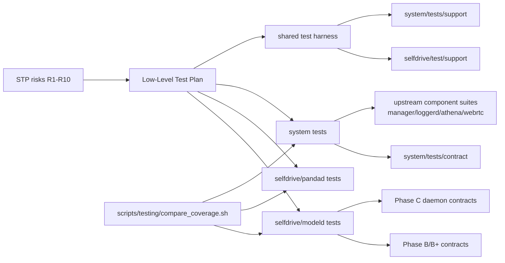
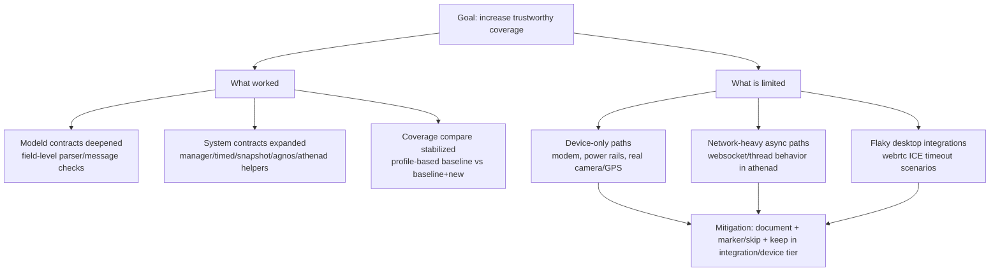

# Presentation Pack: Testing Case Study (openpilot)

This file is now a presentation-ready content pack you can copy into slides.

## 1) Repo Architecture Diagram (testing-focused)



Slide message: we kept the assignment scope narrow, reused upstream integration anchors, and added high-signal contract tests around them.

## 2) Key Findings and Limitations Diagram



Slide message: we improved confidence where desktop testing is valid, and explicitly documented where only integration/device testing is meaningful.

## 3) Code Snippets To Show (minimal, high-value)

### Snippet A: Shared testing harness (fixture layer)

Use `system/tests/support/fixtures.py` to show reusable setup and why tests stay small.

```python
@pytest.fixture
def system_pub_sub_factory():
  def _make(pub_services: list[str], sub_services: list[str], **sub_kw):
    from openpilot.system.tests.support.messaging import make_pub_sub
    return make_pub_sub(pub_services, sub_services, **sub_kw)
  return _make
```

Talking point: this fixture standardizes pub/sub setup so contract tests focus on assertions, not boilerplate.

### Snippet B: Hardware boundary broken safely (simulation + no daemon start)

Use `system/tests/contract/test_messaging_simulation_contract.py`.

```python
def test_device_state_pub_sub_roundtrip(system_pub_sub_factory, monkeypatch):
  monkeypatch.setenv("SIMULATION", "1")
  pub, sub = system_pub_sub_factory(["deviceState"], ["deviceState"], ignore_alive=["deviceState"])
```

Talking point: we validate IPC behavior on desktop without pretending real hardware exists.

### Snippet C: Device-heavy logic reduced to deterministic helper contracts

Use `system/tests/contract/test_agnos_contracts.py`.

```python
monkeypatch.setattr(agnos, 'get_partition_path', lambda *_a, **_k: str(img))
monkeypatch.setattr(agnos, 'verify_partition', lambda *_a, **_k: False)
agnos.flash_partition(0, part, cloudlog=type('C', (), {'info': lambda *a, **k: None})(), standalone=True)
assert data[4:] == ('a' * 64).encode()
```

Talking point: we tested partition/hash contracts with mocked I/O instead of running flash operations.

### Snippet D: Regression harness and fairness rule

Use `scripts/testing/compare_coverage.sh`.

```bash
if [[ "$INCLUDE_BASELINE_IN_OURS" == "1" ]]; then
  OUR_TESTS="$BASELINE_TESTS $OUR_TESTS"
fi
```

Talking point: comparison is now fair (`baseline` vs `baseline + new tests`) and profile-scoped (`modeld`, `pandad`, `system`).

## 4) Nonfunctional Testing Insights (slide-ready)

- Performance/timeliness contracts were added for `modeld` publishing behavior (execution time threshold and frame consistency checks).
- Stability was prioritized over raw test count: we avoided flaky desktop-only network/device paths in default baseline runs.
- Test determinism improved through single-process coverage collection (`pytest -n 0`) and explicit environment setup for subprocesses.
- Maintainability improved by fixture reuse (`system/tests/support`) and contract naming that maps to STP risks.

## 5) Regression Testing Insights (slide-ready)

- We preserved upstream anchor tests and layered new contract tests around them rather than replacing established suites.
- Coverage deltas became actionable only after excluding test modules and empty files from reports and using per-profile configs.
- `system` now compares against original baseline plus new tests, so coverage regressions represent real signal, not measurement artifacts.
- Known regressions are documented as boundary limits (hardware/network dependent) with explicit rationale in `docs/testing/SYSTEM-TESTING.md`.

## 6) Process Improvement Recommendations

- Keep the contract suite desktop-safe and fast, then map deep behavior to upstream integration/device suites.
- Require every new contract test to include: mapped risk, boundary assumptions, and skip/marker rationale.
- Continue using profile-based coverage in CI for targeted quality gates per subsystem.
- Add a lightweight weekly review checklist: failing tests, new risks found, boundary gaps, and next-sprint targets.

## 7) Suggested 10-minute Slide Order

1. Problem and quality goals (1 min)
2. Architecture/testing map diagram (2 min)
3. Findings and limitations diagram (2 min)
4. 3-4 curated snippets (2 min)
5. Nonfunctional + regression insights (2 min)
6. Recommendations and next steps (1 min)